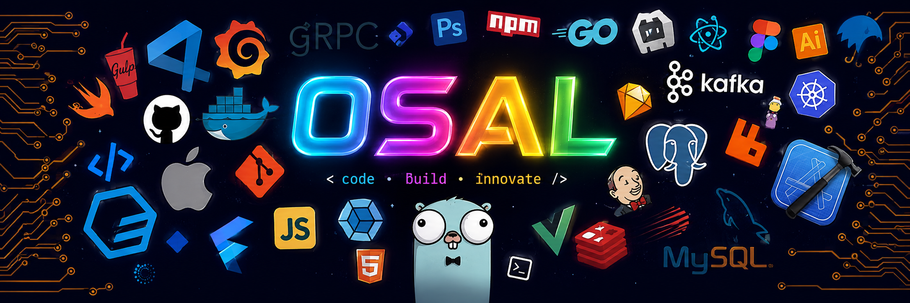

  

  
  

"I’m not an introvert; I just don’t know how to talk to people"

<h3 align="center">SOCIALS</h3>

Nǐ hǎo! Wǒ shì OSAL 
• Interested in UI/UX Design. 
• Aspiring to become a Software Engineer. 
• Learning l Building l Creating l Improving

<h3 align="center">HOBBIES AND INTERESTS</h3>

• Video & Photo Editing 
• Reading l Beatboxing l Running 
• Guitar - fingerstyle & percussion 
• Interested in chinese(speaking) & english(reading) 

# 💻 Tech Stack:
                 
 
<picture>
  <source media="(prefers-color-scheme: dark)"
    srcset="https://raw.githubusercontent.com/itsOsal/itsOsal/output/pacman-contribution-graph-dark.svg">

  
</picture>
# 📊 GitHub Stats:
 
 

---

<!-- Proudly created with GPRM ( https://gprm.itsvg.in ) -->

